# Workflow Flowchart: medaffairs-articles to medaffairs.tech

This flowchart visualizes the complete automated workflow that captures articles from Zapier tables and publishes them to the medaffairs.tech website.

## Complete Workflow Overview

```mermaid
flowchart TD
    %% Data Sources and Triggers
    ZT[📊 Zapier Table<br/>Medical & Healthcare Articles]
    CRON[⏰ Daily Cron<br/>08:00 UTC]
    MANUAL[👤 Manual Trigger<br/>workflow_dispatch]
    
    %% GitHub Actions Workflow
    GHA[🚀 GitHub Actions<br/>update_data.yml]
    
    %% Processing Steps
    CAPTURE[📥 capture_articles.py<br/>Fetch from Zapier Table]
    MD_FILES[📄 Markdown Files<br/>articles/*.md]
    
    GEN_JSON[🔄 generate_articles_json.py<br/>Extract metadata & titles]
    RAW_JSON[📋 Raw JSON<br/>articles.json]
    
    TRANSFORM[⚙️ transform_to_site_format.py<br/>Categorize & structure]
    SITE_JSON[🌐 Website JSON<br/>data/articles.json]
    
    %% Git Operations
    COMMIT[💾 Git Commit<br/>Auto-commit changes]
    PUSH[📤 Git Push<br/>Update repository]
    
    %% External Integration
    DISPATCH[📡 Repository Dispatch<br/>Trigger medaffairs.tech]
    MEDTECH[🌍 medaffairs.tech<br/>Public Website Update]
    
    %% Manual Override Path
    MANUAL_EDIT[✏️ Manual Title Editing<br/>Edit articles.json directly]
    
    %% Flow Connections
    ZT --> CAPTURE
    CRON --> GHA
    MANUAL --> GHA
    GHA --> CAPTURE
    
    CAPTURE --> MD_FILES
    MD_FILES --> GEN_JSON
    GEN_JSON --> RAW_JSON
    
    %% Manual editing integration
    MANUAL_EDIT -.-> RAW_JSON
    RAW_JSON --> TRANSFORM
    
    TRANSFORM --> SITE_JSON
    SITE_JSON --> COMMIT
    COMMIT --> PUSH
    PUSH --> DISPATCH
    DISPATCH --> MEDTECH
    
    %% Styling
    classDef external fill:#e1f5fe,stroke:#0277bd,stroke-width:2px
    classDef process fill:#f3e5f5,stroke:#7b1fa2,stroke-width:2px
    classDef data fill:#e8f5e8,stroke:#2e7d32,stroke-width:2px
    classDef automation fill:#fff3e0,stroke:#ef6c00,stroke-width:2px
    classDef manual fill:#fce4ec,stroke:#c2185b,stroke-width:2px
    
    class ZT,MEDTECH external
    class CAPTURE,GEN_JSON,TRANSFORM,COMMIT,PUSH,DISPATCH process
    class MD_FILES,RAW_JSON,SITE_JSON data
    class GHA,CRON,MANUAL automation
    class MANUAL_EDIT manual
```

## Detailed Data Flow

## Data Format Evolution

## Quick Reference Flowchart

For a simplified view of the core workflow:

```mermaid
flowchart LR
    A[📊 Zapier Table] --> B[📄 Markdown Files]
    B --> C[📋 articles.json]
    C --> D[🌐 data/articles.json]
    D --> E[🚀 Repository Dispatch]
    E --> F[🌍 medaffairs.tech]
    
    style A fill:#e1f5fe
    style F fill:#e8f5e8
    style B,C,D fill:#f3e5f5
    style E fill:#fff3e0
```

## Scheduling and Triggers

The workflow runs automatically and can be triggered manually:
- **Daily**: 08:00 UTC via cron schedule
- **Manual**: On-demand via GitHub Actions workflow_dispatch
- **Manual Editing**: Direct editing of articles.json preserves custom titles

## Key Components

### Automation
- **GitHub Actions**: `update_data.yml` orchestrates the entire pipeline
- **Daily Schedule**: Runs automatically at 08:00 UTC
- **Manual Trigger**: Can be executed on-demand via workflow_dispatch

### Data Sources
- **Zapier Table**: Primary source of medical and healthcare articles
- **API Integration**: Secure access via `ZAPIER_TABLE_ID` and `ZAPIER_API_KEY`

### Processing Scripts
- **capture_articles.py**: Fetches articles from Zapier and saves as markdown
- **generate_articles_json.py**: Converts markdown to structured JSON array
- **transform_to_site_format.py**: Transforms raw data to website-ready format

### Data Formats
- **Markdown Files**: Human-readable article storage in `articles/` directory
- **Raw JSON**: Simple array format in `articles.json`
- **Website JSON**: Structured format with heroes and categories in `data/articles.json`

### Integration
- **Repository Dispatch**: Triggers immediate update of medaffairs.tech website
- **Git Automation**: Automatically commits and pushes changes
- **Manual Override**: Supports manual title editing with preservation

## Error Handling
- Preserves existing `manual_title` values during regeneration
- Continues processing even if some articles fail
- Provides detailed logging for debugging

## Security
- API credentials stored as GitHub repository secrets
- No sensitive data committed to repository
- Personal Access Token (PAT) for cross-repository communication